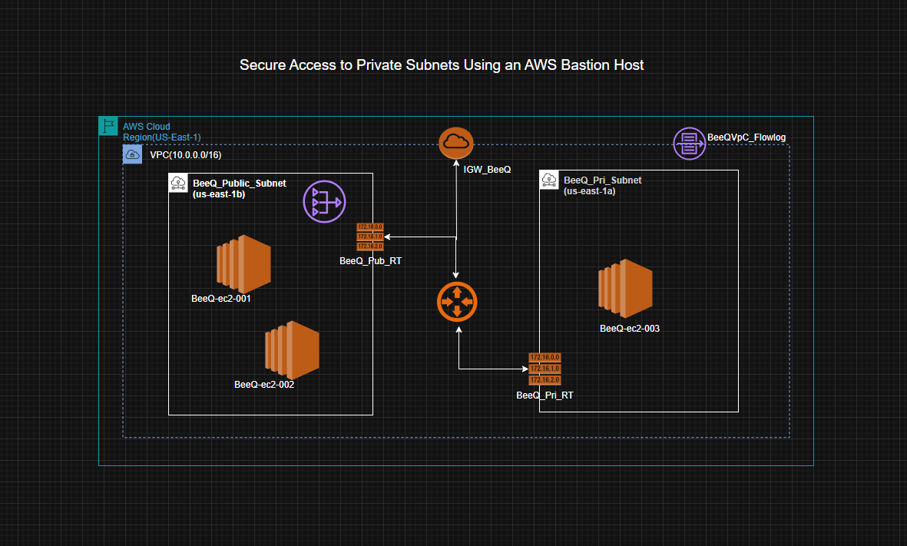

 Secure Access to Private Subnets Using an AWS Bastion Host

📌An AWS bastion host safeguards infrastructure within a private subnet by serving as a
safe point of entry for administrative access.Our Databases and EC2 instances are 
examples of resources in the private subnet that shouldnt be accessed directly from the internet,
not only becasaue it lack public IP addresses, but also the security implication in our network.
Internal servers remain private and inaccessible from public networks and the number of exposed 
system attacker can target are limited.Only the bastion host, which is situated in a public subnet 
and protected by multi-factor authentication (MFA), SSH keys, and IAM policies, allows access.
Internal servers remain private and inaccessible from public networks.

📌Strong network isolation and a smaller attack surface are achieved by security groups, which
only permit incoming traffic to private resources from the bastion host. AWS services like 
CloudTrail and CloudWatch can log and monitor activity because all access is centralized, 
facilitating auditing and quicker incident response. All things considered, an AWS bastion 
host improves cloud security for private subnet infrastructure and offers defense-in-depth.
With the Jump server in the private Subnet,the infrastures in the private subnet can be securely
achived the following :

✔ OS updates
✔ Downloading packages & dependencies
✔ Applications needing external APIs
✔ Legacy software that needs internet access

The solution is built within a custom Amazon Virtual Private Cloud (VPC) and is designed
for high availability across two Availability Zones (AZs).

📌AWS Resources Used

✔ VPC(BeeQ-VPC) with public subnet and private subnets distributed across two AZs

✔ Internet Gateway (IGW-BeeQ) to enable public internet access for resources in public subnets

✔ Route Tables associated with public and private subnets to control traffic routing

✔ NAT Gateway to allow outbound internet access for resources in private subnets

✔ Bastion Host to provide secure administrative access to private resources

✔ Security Groups acting as stateful firewalls to control inbound and outbound traffic

✔ VPC Flow Logs to monitor and log inbound and outbound network traffic.

📌Outcomes And Challenges

Successfully deployed a production ready infrastrueture,didnt come without its challenges,
in term of cost and and choice of service and Implemented AWS best practices for security and scalability
Gained hands-on experience with real-world reference architecture
Demonstrated end-to-end infrastructure design using AWS services

